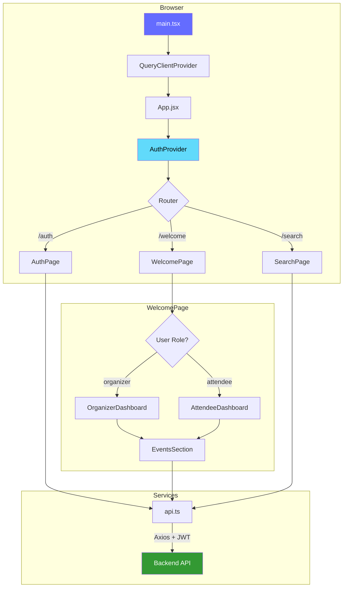

<div align="center">

# 🗓️ EventPlanner — Frontend

**A modern React client for managing events, invitations, and RSVP responses.**


[Features](#-features) · [Quick Start](#-quick-start) · [Architecture](#-architecture) · [Pages & Components](#-pages--components) · [Deployment](#-deployment)

</div>

---

## 📖 Overview

EventPlanner Frontend is the client-side application of the **EventPlanner** platform — a full-stack system where users create events, invite attendees, and manage RSVPs in real time. Built with **React 19**, **Vite**, and **Tailwind CSS**, it provides role-based dashboards for both organizers and attendees, with seamless JWT-based authentication.

> 🔧 **Looking for the backend?** The Node.js + Express API lives in a [separate repository](https://github.com/YoussifHisham/event-planner-project-backend).

---

## ✨ Features

| Category | Details |
|---|---|
| **Authentication** | Login & signup with JWT token management and auto-redirect |
| **Role-Based UI** | Organizers see event management tools; attendees see invitation views |
| **Event Dashboard** | Tabbed interface to switch between organized & invited events |
| **Event Creation** | Modal form for organizers to create events with full detail |
| **Invitation System** | Organizers invite attendees by email directly from event cards |
| **RSVP Responses** | Attendees respond `Going`, `Maybe`, or `Not Going` with instant feedback |
| **Attendee Tracking** | Organizers view the full attendee list with RSVP statuses per event |
| **Advanced Search** | Debounced search by keyword, date range, and role filters |
| **Toast Notifications** | Beautiful, non-blocking feedback via `react-hot-toast` |
| **Protected Routes** | Automatic redirects for unauthenticated users |
| **Docker Support** | Multi-stage Dockerfile with `serve` for production static hosting |

---

## 🛠️ Tech Stack

- **Library:** React 19 (with Hooks)
- **Build Tool:** Vite 7
- **Styling:** Tailwind CSS 3.4 (custom brand color palette)
- **Routing:** React Router DOM 7
- **HTTP Client:** Axios (with JWT interceptor)
- **Server State:** TanStack React Query 5
- **Notifications:** react-hot-toast
- **Date Formatting:** date-fns
- **Containerization:** Docker (Node 20 Alpine + `serve`)
- **Linting:** ESLint 9 with React Hooks & Refresh plugins

---

## 🚀 Quick Start

### Prerequisites

- [Node.js](https://nodejs.org/) v18 or higher
- [npm](https://www.npmjs.com/)
- The [backend API](https://github.com/YoussifHisham/event-planner-project-backend) running on `http://localhost:5000`

### 1 — Clone the Repository

```bash
git clone https://github.com/<your-username>/event-planner-project-frontend.git
cd event-planner-project-frontend
```

### 2 — Install Dependencies

```bash
npm install
```

### 3 — Configure Environment

The project ships with two environment files:

| File | Purpose | `VITE_API_URL` Value |
|------|---------|----------------------|
| `.env.development` | Local development | `http://localhost:5000` |
| `.env.production` | Production build | Your deployed backend URL |

> To change the backend URL locally, edit `.env.development`:
> ```env
> VITE_API_URL=http://localhost:5000
> ```

### 4 — Start the Dev Server

```bash
npm run dev
```

The app starts on **`http://localhost:5173`** (Vite default).

### 5 — Build for Production

```bash
npm run build
npm run preview    # Preview the production build locally
```

---

## 🐳 Docker

### Build & Run

```bash
# Build the production image
docker build -t eventplanner-frontend .

# Run the container
docker run -p 8080:8080 eventplanner-frontend
```

The Dockerfile uses a multi-step process:
1. Installs dependencies with `npm install`
2. Builds the production bundle with `npm run build`
3. Serves static files via `serve` on **port 8080** (OpenShift-compatible)

> **Tip:** Set `VITE_API_URL` in `.env.production` to your backend's deployed URL before building the Docker image, since Vite inlines environment variables at build time.

---

## 🏗️ Architecture



### Key Patterns

| Pattern | Implementation |
|---------|---------------|
| **Context API** | `AuthContext` manages user state, login, register, and logout across the app |
| **JWT Interceptor** | Axios request interceptor auto-attaches `Authorization: Bearer <token>` to every request |
| **Token Persistence** | JWT and user role stored in `localStorage` for session persistence across refreshes |
| **Protected Routes** | Route-level guards redirect unauthenticated users to `/auth` |
| **Debounced Search** | 500ms debounce on search inputs to prevent excessive API calls |
| **Optimistic UI** | New events are prepended to the list immediately after creation |

---

## 📄 Pages & Components

### Pages

| Page | Route | Description |
|------|-------|-------------|
| `AuthPage` | `/auth` | Login & signup forms with role selection (organizer / attendee) |
| `WelcomePage` | `/welcome` | Role-based dashboard — renders `OrganizerDashboard` or `AttendeeDashboard` |
| `SearchPage` | `/search` | Advanced event search with keyword, date range, and role filters |

### Components

| Component | Description |
|-----------|-------------|
| `Navbar` | Top navigation with user info, role badge, search link, and logout |
| `OrganizerDashboard` | Dashboard for organizers with "Create New Event" button and events list |
| `AttendeeDashboard` | Dashboard for attendees showing invited events |
| `EventsSection` | Core event list with tabbed view (organized / invited) and all CRUD actions |
| `CreateEventModal` | Modal form to create a new event (title, date, time, location, description) |
| `AttendanceResponse` | RSVP button group (`Going` / `Maybe` / `Not Going`) for attendees |
| `Button` | Reusable button with loading state and brand styling |
| `Header` | App branding header shown on the auth page |
| `MessageBox` | Feedback message component for success/error states |

### Component Hierarchy

```
App
├── AuthPage
│   ├── Header
│   ├── LoginForm
│   │   └── Button
│   └── SignupForm
│       └── Button
├── WelcomePage
│   ├── Navbar
│   │   └── Button
│   ├── OrganizerDashboard
│   │   ├── CreateEventModal
│   │   │   └── Button
│   │   └── EventsSection
│   │       ├── AttendanceResponse
│   │       ├── CreateEventModal
│   │       └── Button
│   └── AttendeeDashboard
│       └── EventsSection
│           └── AttendanceResponse
└── SearchPage
    └── Navbar
```

---

## 🎨 Design System

The app uses a **custom Tailwind CSS brand palette** defined in `tailwind.config.js`:

| Token | Hex | Usage |
|-------|-----|-------|
| `brand-dark` | `#0C2B4E` | Primary buttons, header text |
| `brand-medium` | `#1A3D64` | Button hover state |
| `brand-accent` | `#1D546C` | Focus rings, accent links |
| `brand-gray` | `#F4F4F4` | Background surfaces |

Role-based color coding:
- 🟢 **Organizer** — Green badges & accents (`bg-green-600`)
- 🔵 **Attendee** — Blue badges & accents (`bg-blue-600`)

---

## 📁 Project Structure

```
event-planner-project-frontend/
├── public/                     # Static assets
├── src/
│   ├── assets/                 # Images & icons
│   ├── components/
│   │   ├── AttendanceResponse.jsx   # RSVP button group
│   │   ├── AttendeeDashboard.jsx    # Attendee main view
│   │   ├── Button.jsx               # Reusable button
│   │   ├── CreateEventModal.jsx     # Event creation modal
│   │   ├── EventsSection.jsx        # Tabbed event list + CRUD
│   │   ├── Header.jsx               # Auth page branding
│   │   ├── MessageBox.jsx           # Success/error messages
│   │   ├── Navbar.jsx               # Top navigation bar
│   │   └── OrganizerDashboard.jsx   # Organizer main view
│   ├── contexts/
│   │   └── AuthContext.tsx      # Auth state management
│   ├── pages/
│   │   ├── AuthPage.jsx         # Login & signup
│   │   ├── SearchPage.jsx       # Event search
│   │   └── WelcomePage.jsx      # Dashboard (role-based)
│   ├── services/
│   │   └── api.ts               # Axios instance + JWT interceptor
│   ├── App.jsx                  # Route definitions
│   ├── App.css                  # Global styles
│   ├── index.css                # Tailwind directives
│   └── main.tsx                 # Application entry point
├── .env.development             # Dev environment config
├── .env.production              # Production environment config
├── Dockerfile                   # Production container
├── tailwind.config.js           # Tailwind customization
├── vite.config.js               # Vite configuration
├── postcss.config.js            # PostCSS plugins
├── eslint.config.js             # ESLint rules
├── package.json
└── README.md
```

---

## 🔒 Security

| Concern | Implementation |
|---------|---------------|
| **Token Storage** | JWT stored in `localStorage` with automatic attachment via Axios interceptor |
| **Route Protection** | Unauthenticated users are redirected to `/auth`; logged-in users skip auth page |
| **Session Persistence** | JWT payload is decoded on mount to restore user sessions |
| **Role Enforcement** | UI components conditionally render based on user role |
| **CORS** | API requests go through the configured `VITE_API_URL` origin |
| **Input Validation** | HTML5 form validation with `required` and `minLength` constraints |

---

## 🔗 Backend Integration

This frontend connects to the **EventPlanner Backend API** via Axios. All API calls are routed through `src/services/api.ts`.

| Frontend Action | API Endpoint | Method |
|----------------|--------------|--------|
| Login | `/auth/login` | `POST` |
| Register | `/auth/signup` | `POST` |
| Create Event | `/events` | `POST` |
| Get Organized Events | `/events/organized` | `GET` |
| Get Invited Events | `/events/invited` | `GET` |
| Delete Event | `/events/:id` | `DELETE` |
| Invite User | `/events/:event_id/invite` | `POST` |
| RSVP to Event | `/events/:id/respond` | `POST` |
| View Attendees | `/events/:id/attendees` | `GET` |
| Search Events | `/events/search` | `GET` |

> For full API documentation, see the [Backend README](https://github.com/YoussifHisham/event-planner-project-backend).

---

## 🌐 Deployment

This frontend is deployment-ready for **Red Hat OpenShift** and any Docker-compatible platform:

| Platform | Status |
|----------|--------|
| **OpenShift** | Production deployment on port 8080 (OpenShift standard) |
| **Docker** | Multi-stage Dockerfile with `serve` static server |
| **Vercel / Netlify** | Compatible — configure `VITE_API_URL` as an environment variable |

### Environment Variable (Build-Time)

Since Vite inlines environment variables at build time, ensure `VITE_API_URL` is set **before** running `npm run build`:

```bash
# For Docker builds, update .env.production first:
VITE_API_URL=https://your-backend-url.com
```

---

## 📜 Available Scripts

| Script | Command | Description |
|--------|---------|-------------|
| **Dev** | `npm run dev` | Start Vite dev server with HMR |
| **Build** | `npm run build` | Create optimized production bundle |
| **Preview** | `npm run preview` | Preview production build locally |
| **Lint** | `npm run lint` | Run ESLint across all source files |

---

## 📄 License

This project is licensed under the **ISC License**.

---

<div align="center">

**Built with ❤️ using React, Vite & Tailwind CSS**

</div>
